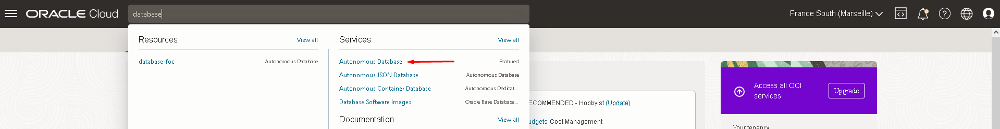
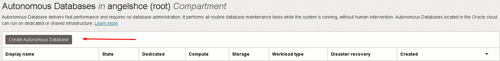
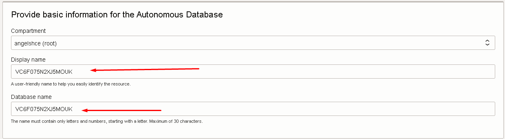
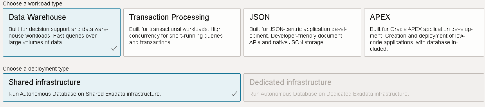
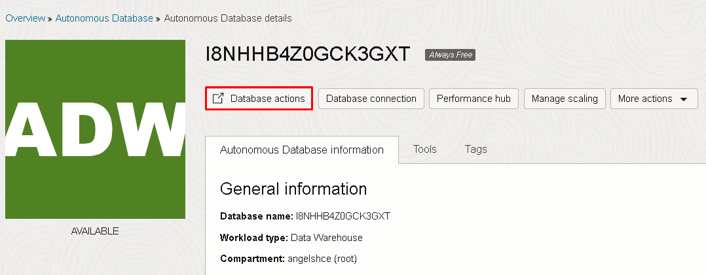
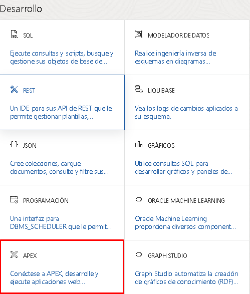
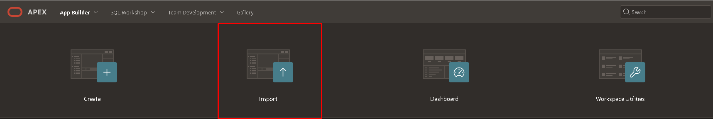
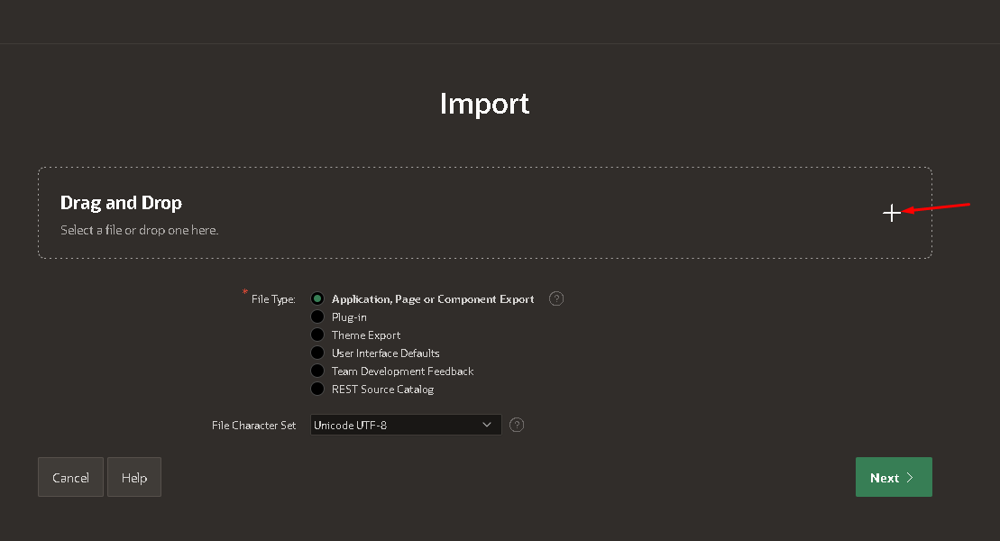
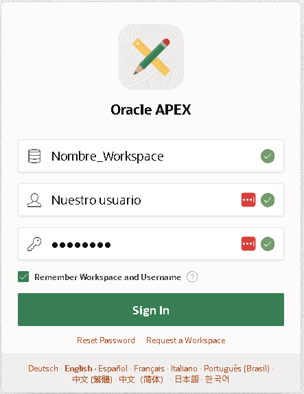

# Tutorial de Instalación de [RHS]

En este tutorial te mostraremos los pasos necesarios para instalar [RHS].

## Requisitos Previos

- Variante 1 - Cuenta Oracle CLOUD -> [Oracle Cloud Free tier](https://www.oracle.com/cloud/free/?source=:ow:o:h:po:OHPPanel1nav0625&intcmp=:ow:o:h:po:OHPPanel1nav0625)
- Variante 2 - Cuenta Oracle apex  -> [Oracle apex](https://apex.oracle.com/es/)
- Archivo de instalacion ***.sql***

***

# Variante 1:

## Pasos de Instalación

1. Descarga el archivo de instalación de [RHS] desde el siguiente enlace: [Enlace de Descarga](https://www.ejemplo.com/descargar)
2. Una vez descargado el archivo procederemos a crearnos una cuenta en Oracle cloud: [Oracle cloud](https://www.oracle.com/cloud/free/?source=:ow:o:h:po:OHPPanel1nav0625&intcmp=:ow:o:h:po:OHPPanel1nav0625)
3. Cuando tengamos a cuenta creada accederemos al panel de control y en la barra de busqueda pondremos ***"Database"***
4. Deberemos acceder a ***"Autonomus database"***

5. Ahora procederemos a crear nuestra base de datos donde se alojara nuestra aplicacion.

6. Luego empezaremos el "Wizard" donde iremos cumplimentando los datos necesarios.
    - Cumplimentaremos el ***"Display name"*** este sera un nombre para identificar rapidamente el recurso en caso que dispongamos de otras bases de datos.
    - Luego el ***"Database Name"*** este sera el nombre interno de nuestra base de datos.
   

7. El siguiente paso sera seleccionar el tipo de ***"workload"*** que va tener nuestra base de datos. Para esta aplicacion seleccionaremos
***"Data warehouse"*** y al ser una base de datos utilziando el ***"Free tier"*** seleccionaremos ***"Shared infrastructure"*** en caso de querer ampliar la aplicacion
Podremos seleccionar ***"Dedicated infrastructure"*** y utilizar los recursos de pago de oracle CLOUD

8. Finalmente procederemos a crear la base de datos.

9. Una vez nuestra base de datos este en estado ***"AVAILABLE"*** accederemos al boton de ***"Database Actions"***

10. Accederemos a la opcion ***"Apex"*** 

11. Nos indicara que introduzcamos un nombre de ***"Workspace"*** este sera nuestro espacio de trabajo. Una vez accedemos deberemos realizar lo siguiente:
    - Daremos al boton de ***"Import"***
    
    - Una vez dentro daremos click al ***"+"***
    
    - Continuaremos con el boton ***"Next"*** y a continuacion el boton ***"Install Application"*** Continuaremos dando click al boton ***"Next"***
    
12. Una vez que se complete la instalacion de la aplicacion y los objetos de soporte ya tendremos nuestra aplicacion correctamente instalada.

# Variante 2:

1. El primer paso sera crearnos una cuenta en https://apex.oracle.com/es/ y tendremos que solicitar un ***"workspace"***.
2. Cumplimentaremos los datos del ***"wizard"*** y deberemos recordar el nombre que asignamos a nuestro ***"Workspace"*** ya que sera necesario para el inicio de sesion luego.
3. Una vez terminamos los pasos, Recibiremos un correo con los datos. y deberemos acceder mediante el login de la web.
4. Solo tendremos que hacer login usando nuestros datos introducidos anteriormente.

    
5. Una vez dentro repitiremos el paso ***11*** y ***12*** de la ***Variante 1***
